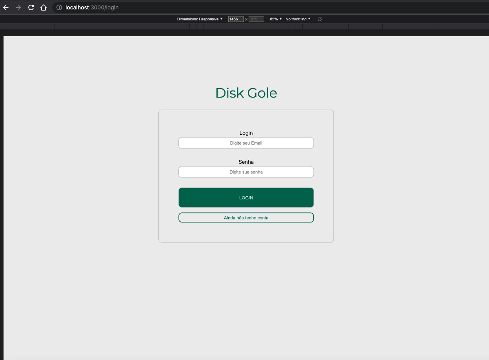
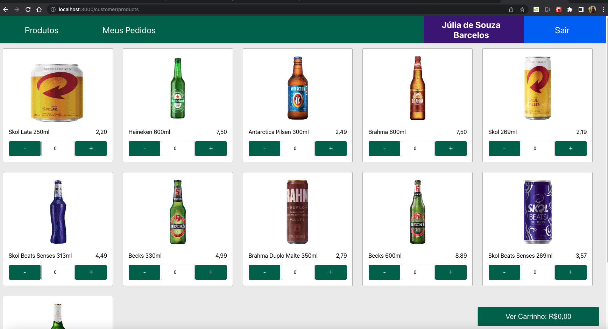
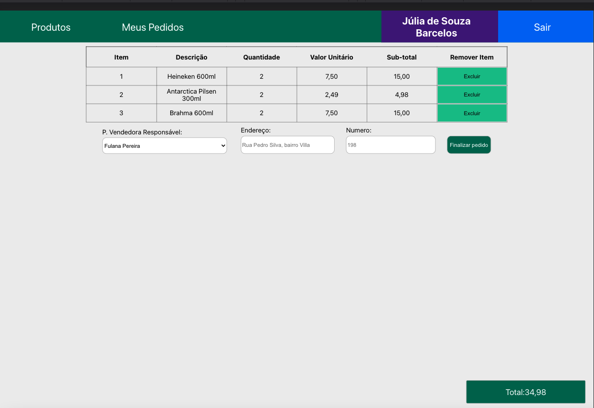
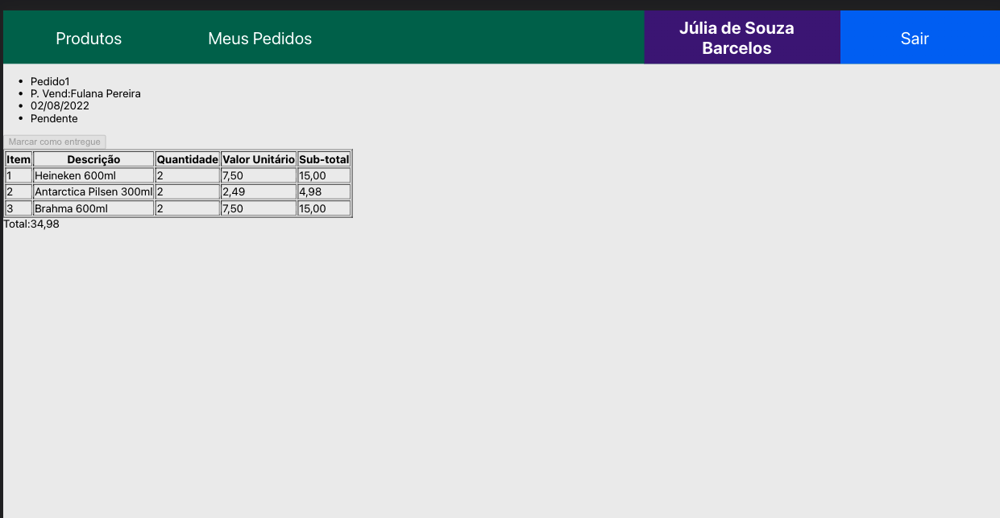

# Hello!

This project was developer in a group. It is a full stack application.

<details>
  <summary>
    <strong>🗂 About school experience </strong>
  </summary><br>
   It is a project to improve our knologe during our frontend and backend module in Trybe course.
After take a good note in that one, we are finally called as a full stack developer.
We made all parts of this code, frontend and backend, exeped __tests__ file.
</details>

<details>
  <summary>
    <strong>👷 Team </strong>
  </summary><br>
    Bruno Moraes,
    Italo Moraes,
    Julia Barcelos (myself),
    Julio César Nunes,
    Mabiane Polniak and
    Vanessa Rios.
</details>

<details>
  <summary>
    <strong>👨‍💻 Planning and teams </strong>
  </summary><br>
We divided the group in three teams: frontend, backend and bridge.
I had opportunitie to participated in two of then: frontend and bridge teams.

<details>
  <summary>
    <strong>👷 Frontend </strong>
  </summary><br>
    Julia Barcelos (myself),
    Mabiane Polniak and
    Vanessa Rios.
</details>

<details>
  <summary>
    <strong>👷 Backend </strong>
  </summary><br>
    Bruno Moraes,
    Italo Moraes and
    Julio César Nunes
</details>

<details>
  <summary>
    <strong>👷 Bridge </strong>
  </summary><br>
    Italo Moraes,
    Julia Barcelos (myself) and
    Vanessa Rios.
</details>

</details>

## My participation in this project:

I started making a setup for frontend applications and collaborating with communication definitions to facilitate the bridge.
We in the bridge team made a map to define the names and structure of our backend and database.
I helped the backend team understand our necessity for different routes and ways to access them.
This strategy permitted the frontend to 'mock' some similar to the developer while the backend structures the database and writes the routes.

In the frontend team, I made the Login page and all components that were used there.
I made the Admin page and refactored the Register page to make both use a similar code.
I made all the utils functions to optimize this Axios request in a dedicated place to that.
I also developed the Address component inside of checkout page.

## This project is not using docker.
## You will need to use the localhost 3000 and 3001 port to access or write an env file.


## About project

This project is like a zé delivery.
At Brazil, this company is a website to buy things to drink and receive in your home.

## How it looks







## Get this project to your machine:

Go to a repository you like to save it and make a clone:

```git clone git@github.com:jubarcelos/appDelivery.git```

Open the repository and in the general terminal, execute these commands:

``` npm install ```
``` dev:prestart ```

It will download all the project dependences.

## Start backend:

In the backend terminal, execute this command:

``` npm run dev ```

It will up the DB and start a backend.

## Start frontend:

In the frontend terminal, execute this command:

``` npm start ```

It will up the user view, the page.

## Tests from school:

From the general terminal, to run the tests:

You can use this command:

``` npm run test ```

Or this other to see the page occurrences:

``` HEADLESS=false npm run test ```


## Things to improve

- [ ] Make a responsive website;
- [ ] Use a supabase to db;
- [ ] Use a Heroku to the backend repository individual;
- [ ] Use a GitHubPages os another to up the user view page;
- [ ] Reviewer and refactor some other components;
- [ ] End the project, with bonus requirements.
